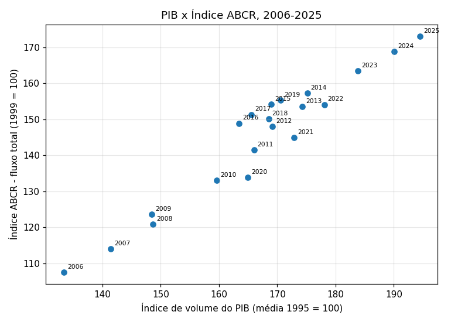
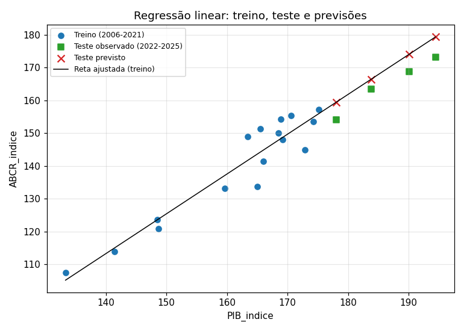

## Integrantes
| Nome completo | RM |
|---|---|
| Eduardo Barcelos De Carvalho Braziliano | 573274 |
| Julia Johanson Peniche Dias Da Silva | 572220 |
| Lucas Bomfim Leite | 570420 |

# Regressão linear com PIB e Índice ABCR

Investigação da relação entre a **atividade econômica brasileira** (índice de volume do PIB) e o **fluxo de veículos nas rodovias** (Índice ABCR), com um modelo de **regressão linear** em Python (scikit-learn), usando 20 anos completos em comum (2006–2025).

O **Produto Interno Bruto (PIB)** é o valor dos bens e serviços finais produzidos em um país durante um período. O **índice de volume do PIB** acompanha a evolução da produção descontando o efeito das mudanças de preços; na série utilizada, a média de 1995 corresponde a 100.

## Dados

| Indicador | Fonte | Arquivo | Detalhe |
|---|---|---|---|
| Índice de volume do PIB | IBGE, [Tabela 1620 do SIDRA](https://sidra.ibge.gov.br/tabela/1620) | `dados/tabela1620.xlsx` e `dados/tabela1620.csv` | Série encadeada, sem ajuste sazonal, base média 1995 = 100. Brasil, "PIB a preços de mercado", 1º tri/2006 a 4º tri/2025. |
| Índice ABCR | ABCR, [Índice ABCR](https://melhoresrodovias.org.br/indice-abcr_2/) (edição de agosto/2026) | `dados/abcr_0826.xlsx` | Aba `(C) Original` (série original, sem ajuste sazonal), bloco Brasil, coluna TOTAL (leves + pesados), base 1999 = 100. |

### Base organizada (`dados/base_pib_abcr.csv`)

| Coluna | Conteúdo |
|---|---|
| `Ano` | Ano de referência dos dois indicadores (2006 a 2025). |
| `PIB_indice` | Média dos quatro índices trimestrais do PIB. |
| `ABCR_indice` | Média dos doze índices mensais da ABCR. |

Foram usados os **números-índice**, não as variações percentuais. O notebook confere (com `assert`) que há 20 anos consecutivos, sem valores faltantes, 4 trimestres e 12 meses em cada ano. Também confere que o CSV e o XLSX da Tabela 1620 trazem os mesmos valores.

## Análise da relação



A **correlação de Pearson é ≈ 0,96**: relação positiva e muito forte, aproximadamente linear. O ano de 2020 (pandemia) fica abaixo da reta, pois o fluxo de veículos caiu muito mais do que o PIB. Como as duas séries crescem com o tempo, parte da correlação pode vir apenas dessa tendência em comum.

## Modelo

- Entrada `X`: `PIB_indice`; alvo `y`: `ABCR_indice` (`LinearRegression`, `fit`, `predict`).
- **Treino:** primeiros 16 anos (2006–2021). **Teste:** últimos 4 anos (2022–2025), em ordem cronológica, sem embaralhar.
- Equação ajustada: **ABCR ≈ −56,79 + 1,2145 × PIB** (R² no treino ≈ 0,90).

### Resultados (conjunto de teste)

| Métrica | Valor |
|---|---|
| MAE | 4,95 |
| MSE | 25,95 (RMSE ≈ 5,09) |
| R² | 0,485 |

| Ano | PIB_indice | ABCR observado | ABCR previsto | Erro (prev − obs) | Erro % |
|---|---|---|---|---|---|
| 2022 | 178,05 | 154,12 | 159,46 | 5,34 | 3,46 |
| 2023 | 183,82 | 163,49 | 166,47 | 2,98 | 1,82 |
| 2024 | 190,10 | 168,88 | 174,10 | 5,22 | 3,09 |
| 2025 | 194,45 | 173,12 | 179,38 | 6,26 | 3,62 |



**Significado das métricas:** o MAE é o erro médio em pontos de índice (≈ 5 pontos, cerca de 3% do nível do ABCR no teste); o MSE é o erro médio ao quadrado e penaliza erros grandes; o R² é a fração da variação do teste explicada pelo modelo, comparada a prever a média (1 = perfeito, 0 = igual à média).

## Conclusões

1. Existe **relação positiva muito forte** entre o PIB e o fluxo de veículos (correlação ≈ 0,96): quando a atividade econômica cresce, o fluxo nas rodovias pedagiadas tende a crescer junto.
2. O modelo produziu estimativas **próximas dos valores reais** (erros entre ≈ 2% e 4%), mas **superestimou os quatro anos de teste**. No período recente o fluxo cresceu menos por ponto de PIB do que a relação média 2006–2021 indicava. O R² moderado (0,48) reflete esse viés, e com apenas 4 pontos de teste ele é uma métrica instável.
3. **Limitações:** só 20 observações anuais; séries com tendência em comum; 2020 é um ponto atípico no treino; o ABCR cobre rodovias pedagiadas, não todo o país; e as duas séries têm bases diferentes (1995 = 100 e 1999 = 100), então o coeficiente não é uma elasticidade.
4. **Correlação alta não demonstra causa e efeito.** Para investigar causalidade seria preciso, por exemplo, usar variações (taxas de crescimento), outras variáveis e séries mais longas.

## Dificuldades e soluções

| Dificuldade | Solução |
|---|---|
| A planilha da ABCR tem várias abas e blocos de colunas (Brasil, São Paulo, Paraná, Rio de Janeiro). | Usei a aba `(C) Original` e o bloco Brasil / TOTAL, conferindo os cabeçalhos. |
| A aba `(D) Dessazonalizado` também traz números-índice. | Descartada: o enunciado pede séries sem ajuste sazonal. |
| O CSV da Tabela 1620 tem linhas de cabeçalho com número de colunas diferente e quebra `pd.read_csv`. | Li o XLSX com `pandas` e usei o módulo `csv` só para validar os valores. |
| PIB trimestral (4 valores/ano) e ABCR mensal (12 valores/ano). | Média anual das duas séries, com `assert` na contagem de períodos. |
| A ABCR vai até agosto/2026, mas o PIB só até 2025. | Restringi a 2006–2025, os 20 anos completos em comum. |
| No Google Colab, o notebook não encontrava a pasta `dados/`. | Célula inicial que clona o repositório (público, URL correta) quando a pasta não existe. |

## Como executar

**No Google Colab:** abra o notebook, troque `REPO_URL` na primeira célula pela URL do repositório e execute as células em ordem. A célula clona o repositório e entra na pasta, e o restante roda normalmente. Se atualizar arquivos no GitHub depois do clone, reinicie a sessão (ou rode `!git pull` dentro da pasta do repositório).

**Localmente:**
```bash
git clone <URL-DO-SEU-REPOSITORIO>
cd CP2_MLAM
pip install numpy pandas matplotlib scikit-learn openpyxl jupyter
jupyter notebook notebook_regressao_pib_abcr.ipynb
```

## Estrutura

```
├── notebook_regressao_pib_abcr.ipynb   # fontes, dados, código, resultados e conclusão
├── images/                             # gráficos usados neste README
│   ├── dispersao.png
│   └── real_vs_previsto.png
├── dados/
│   ├── abcr_0826.xlsx                  # Índice ABCR (série original)
│   ├── tabela1620.xlsx                 # PIB, IBGE (Tabela 1620)
│   ├── tabela1620.csv                  # mesma tabela em CSV
│   └── base_pib_abcr.csv               # base final (Ano, PIB_indice, ABCR_indice)
└── README.md
```

## Tecnologias

Python · Pandas · NumPy · Matplotlib · scikit-learn · openpyxl

## Referências

- [IBGE, SIDRA, Tabela 1620](https://sidra.ibge.gov.br/tabela/1620)
- [ABCR, Índice ABCR](https://melhoresrodovias.org.br/indice-abcr_2/)

> Uma correlação alta, por si só, não demonstra uma relação de causa e efeito.
