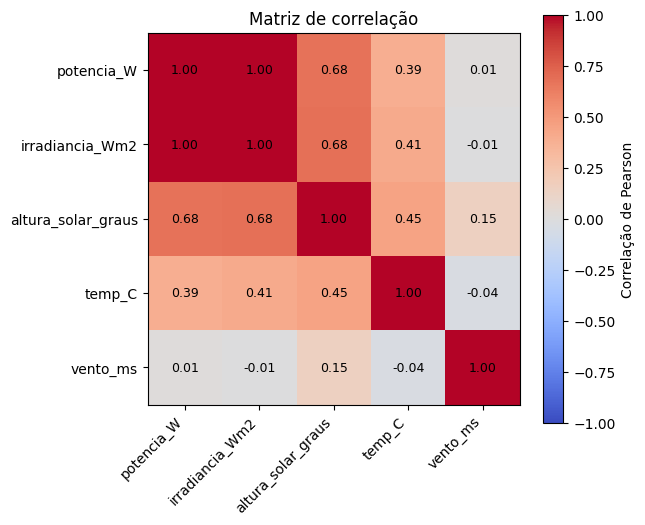

## Integrantes
| Nome completo | RM |
|---|---|
| Eduardo Barcelos De Carvalho Braziliano | 573274 |
| Julia Johanson Peniche Dias Da Silva | 572220 |
| Lucas Bomfim Leite | 570420 |

# Regressão Linear com Dados de Energia Solar (PVGIS)

Projeto de Machine Learning que estima a **potência gerada por um sistema fotovoltaico** a partir de variáveis meteorológicas e solares, usando **Regressão Linear** e dados horários reais obtidos da API pública do [PVGIS](https://joint-research-centre.ec.europa.eu/pvgis-photovoltaic-geographical-information-system_en) (Joint Research Centre, Comissão Europeia).

O notebook percorre o fluxo completo de um problema de regressão: obtenção dos dados via API, inspeção, visualização, correlação, separação treino/teste, treinamento de dois modelos, avaliação (MAE, MSE e R²) e análise crítica dos resultados.

## Dados

| Item | Valor |
|---|---|
| Fonte | PVGIS, endpoint `seriescalc` (dados horários), versão 5.3 |
| Local | São Paulo – SP (lat. -23,5505; lon. -46,6333) |
| Período | 2020 a 2022 |
| Sistema simulado | 1 kWp, perdas de 14%, ângulos ótimos (`optimalangles=1`) |
| Tamanho | 26.304 registros horários |

Requisição utilizada:

```
https://re.jrc.ec.europa.eu/api/v5_3/seriescalc?lat=-23.5505&lon=-46.6333&startyear=2020&endyear=2022&pvcalculation=1&peakpower=1&loss=14&optimalangles=1&outputformat=json
```

Nenhum CSV pronto é utilizado: os dados são baixados diretamente da API ao executar o notebook.

### Variáveis

| Coluna | Original (PVGIS) | Descrição |
|---|---|---|
| `potencia_W` | `P` | Potência do sistema FV (W) — **variável alvo (y)** |
| `irradiancia_Wm2` | `G(i)` | Irradiância no plano dos módulos (W/m²) |
| `altura_solar_graus` | `H_sun` | Altura do Sol (graus) |
| `temp_C` | `T2m` | Temperatura do ar a 2 m (°C) |
| `vento_ms` | `WS10m` | Velocidade do vento a 10 m (m/s) |

## Preparação dos dados

- Não há valores ausentes.
- **50,8%** dos registros (13.371) têm irradiância zero, ou seja, são horas noturnas.
- Esses registros foram **removidos** (`irradiância > 0`), ficando **12.933 linhas**. Mantê-los inflaria o R² (prever 0 W à noite é trivial) e criaria correlações artificiais com temperatura e vento pelo ciclo dia/noite. O modelo, portanto, estima a potência *durante o período com geração*.

## Exploração

### Dispersão entre as variáveis de entrada e a potência


### Matriz de correlação



Correlação de cada variável com a potência:

| Variável | Correlação (r) |
|---|---|
| `irradiancia_Wm2` | 0,998 |
| `altura_solar_graus` | 0,675 |
| `temp_C` | 0,387 |
| `vento_ms` | 0,013 |

A irradiância domina a relação (praticamente linear), e o vento tem correlação desprezível com a potência.

## Modelos

Divisão **80% treino / 20% teste** (`random_state=42`): 10.346 amostras de treino e 2.587 de teste. Os dois modelos usam a mesma divisão, então são avaliados nas mesmas linhas.

- **Modelo 1 (`modeloLR1`)**: `irradiancia_Wm2`, `altura_solar_graus`, `temp_C`, `vento_ms`.
- **Modelo 2 (`modeloLR2`)**: `altura_solar_graus`, `temp_C`, `vento_ms` (sem a irradiância, para medir o quanto ela contribui).

### Resultados (conjunto de teste)

| Modelo | Variáveis utilizadas | MAE (W) | MSE (W²) | R² |
|---|---|---|---|---|
| Modelo 1 | irradiância, altura solar, temperatura, vento | **9,296** | **140,03** | **0,9979** |
| Modelo 2 | altura solar, temperatura, vento | 148,383 | 33.562,60 | 0,4862 |


## Conclusões

- O **Modelo 1** é melhor nas três métricas (maior R², menor MAE e menor MSE). Sem a irradiância, o R² cai de 0,998 para 0,486.
- A variável mais correlacionada com a potência (a irradiância) é também a que sustenta o melhor modelo, mas correlação alta, por si só, não garante o melhor conjunto: variáveis correlacionadas entre si (como irradiância e altura solar) trazem informação redundante.
- Dificuldades para um modelo linear: não linearidade da eficiência do módulo (temperatura e baixa irradiância), multicolinearidade, dependência temporal dos dados horários (divisão aleatória pode deixar o teste parecido demais com o treino) e interações entre variáveis.

>  **Ressalva:** a potência `P` do PVGIS é **simulada** a partir da irradiância e da temperatura, não medida em uma usina real. Por isso o R² do Modelo 1 é tão alto (a regressão basicamente reaprende uma fórmula física). Com dados medidos de campo, espera-se desempenho menor.

##  Como executar

1. Clone o repositório:
   ```bash
   git clone <URL-DO-SEU-REPOSITORIO>
   cd <NOME-DA-PASTA>
   ```
2. Instale as dependências:
   ```bash
   pip install requests numpy pandas matplotlib scikit-learn jupyter
   ```
3. Abra e execute o notebook (é necessário acesso à internet para consultar a API):
   ```bash
   jupyter notebook Regressao_Linear_Energia_Solar.ipynb
   ```

Para usar outra cidade ou período, altere as variáveis `cidade`, `latitude`, `longitude`, `ano_ini` e `ano_fim` na célula da requisição.

##  Estrutura

```
├── Regressao_Linear_Energia_Solar.ipynb   # notebook com todo o fluxo
├── images/                                # gráficos usados neste README
└── README.md
```

##  Tecnologias

Python · Pandas · NumPy · Matplotlib · scikit-learn · Requests

##  Referências

- [PVGIS – Photovoltaic Geographical Information System (JRC/Comissão Europeia)](https://joint-research-centre.ec.europa.eu/pvgis-photovoltaic-geographical-information-system_en)
